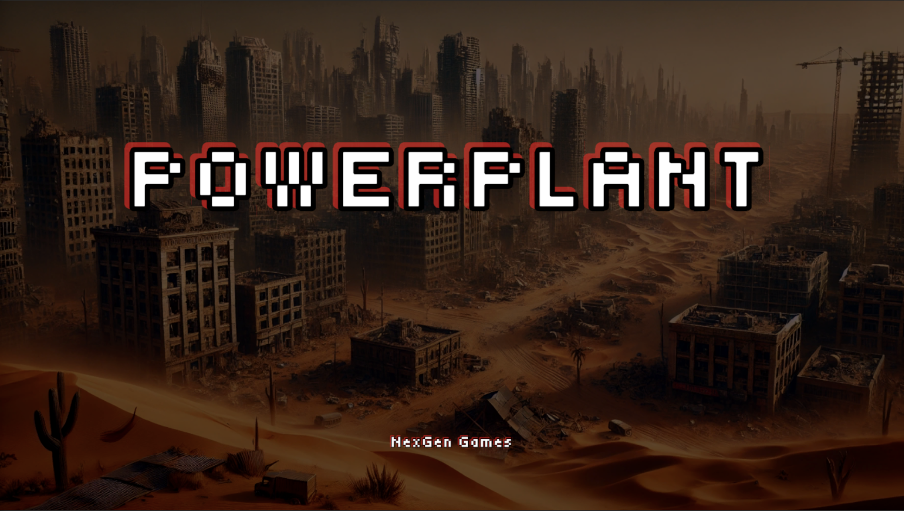
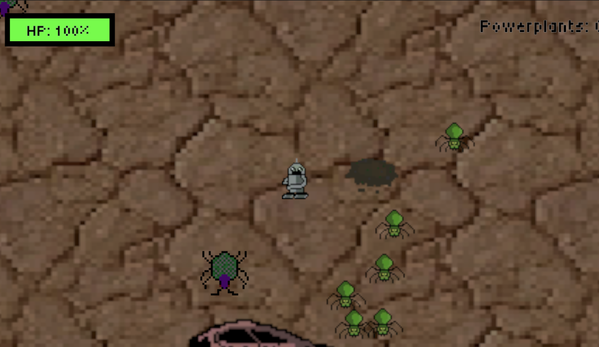

# Powerplant

Company: NexGen Games - Evan, Teddy, Jackson

Story 

>After a nuclear war, all of humanity is forced to live in underground shelters due to unlivable conditions on the surface. A team of scientists develop a power plant called NexGen that can reproduce by itself and absorb radiation in order to make the planet livable again. The scientists send out a AI robot called PHIL (Plant Habilitation and Integration Learner) that can survive the harsh radioactive conditions of the earth and plant the NexGen seeds. However, radioactive critters threaten the mission and force PHIL to protect the planet, no matter what it takes. PHIL is humanity’s last hope.

### **Background:**
&nbsp;&nbsp;&nbsp;&nbsp;&nbsp;&nbsp;&nbsp;&nbsp;&nbsp; Powerplant is a 2D top-down action and adventure game. You play as an AI robot called PHIL (Plant Habilitation and Integration Learner), to spread the NexGen seed. Following the events of a nuclear war, all of humanity is forced to live in underground shelters due to unlivable conditions on the surface. A team of scientists developed a power plant called NexGen that can reproduce by itself and absorb radiation to make the planet livable again. The scientists send out PHIL (Plant Habilitation and Integration Learner) as it can survive the harsh radioactive conditions of the earth and plant the NexGen seeds. However, radioactive critters threaten the mission and force PHIL to protect the planet, no matter what it takes. PHIL is humanity’s last hope. 

### **Objective:**
&nbsp;&nbsp;&nbsp;&nbsp;&nbsp;&nbsp;&nbsp;&nbsp;&nbsp; The main objective of the game is to plant all 5 of the NexGen seeds, avoiding enemy spiders and other insects. As the game progresses, more enemies will spawn, making it grow gradually more difficult.

### **Controls:** 

&nbsp;&nbsp;&nbsp;&nbsp;&nbsp;&nbsp; &nbsp;&nbsp;&nbsp;The game used WASD or arrow keys to move the PHIL. To use the laser mechanic, you click with your mouse to where you want to fire. Finally, you press P to plant the powerplants on their seed patch. After 10 seconds, the seed will turn into a plant and raise your powerplant count.

### **Features and Gameplay:**
	
&nbsp;&nbsp;&nbsp;&nbsp;&nbsp;&nbsp;&nbsp;&nbsp;&nbsp;The main weapon PHIL uses is his laser. He can take out spiders in 1 hit and beetles in 3. As the game progresses the spawn rate of the spiders and beetles becomes more frequent. After 3 plants are planted the max amount of enemies almost doubles. PHIL can use power-ups, such as the laser power-up and health power up in order to survive longer. The laser power-ups increases the laser fire rate for 9 seconds and the health power-up gives PHIL additional health. To beat the game, you must plant all the 5 of the Powerplant seeds. The seeds take 10 seconds to fully plant. 

### **Art and Music:**
&nbsp;&nbsp;&nbsp;&nbsp;&nbsp;&nbsp;&nbsp;&nbsp;&nbsp;The game has a retro aesthetic reminiscent of ‘80s arcade games like Super Mario Bros. It features a desolate terrain rife with broken cars, rocks and other obstacles for PHIL to navigate. As for the music, it combines classic acoustic instrumentation with pulsing synths that heighten the sense of quest.

**Link:**
https://sites.google.com/conncoll.edu/nexgengames

