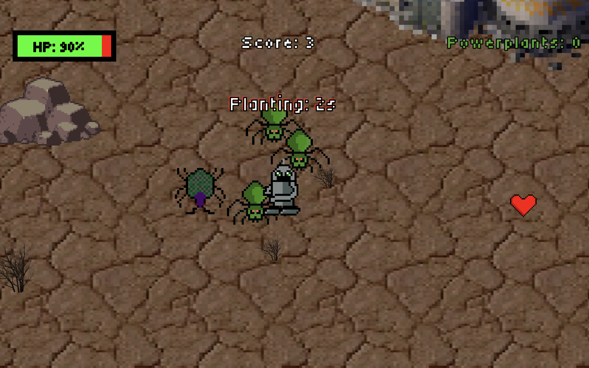

# Powerplant

Company: NexGen Games - Evan, Teddy, Jackson

Story 

>After a nuclear war, all of humanity is forced to live in underground shelters due to unlivable conditions on the surface. A team of scientists develop a power plant called NexGen that can reproduce by itself and absorb radiation in order to make the planet livable again. The scientists send out a AI robot called PHIL (Plant Habilitation and Integration Learner) that can survive the harsh radioactive conditions of the earth and plant the NexGen seeds. However, radioactive critters threaten the mission and force PHIL to protect the planet, no matter what it takes. PHIL is humanity’s last hope.

Objective: Plant all five NexGen seeds in their designated areas while avoiding all enemy mutants and defeating the boss.

